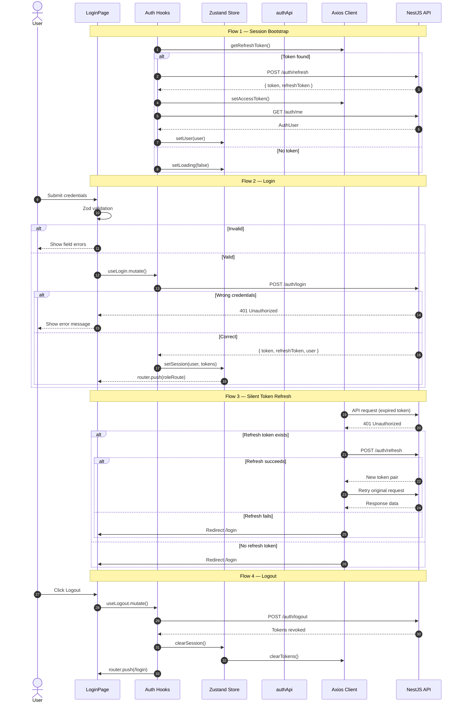
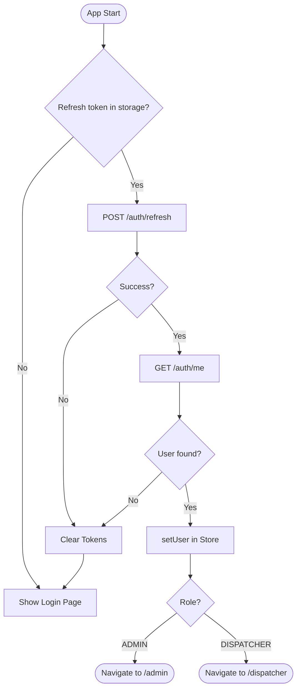
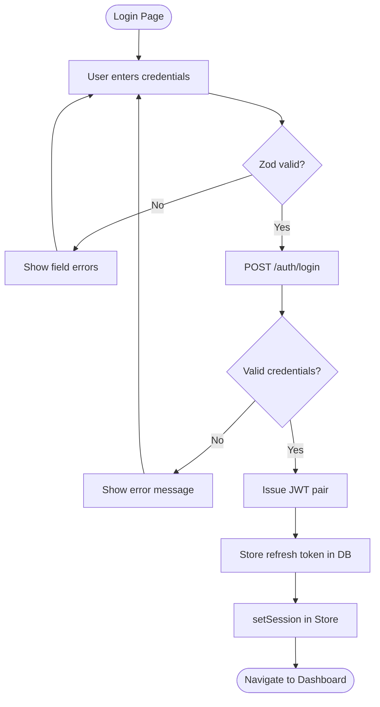
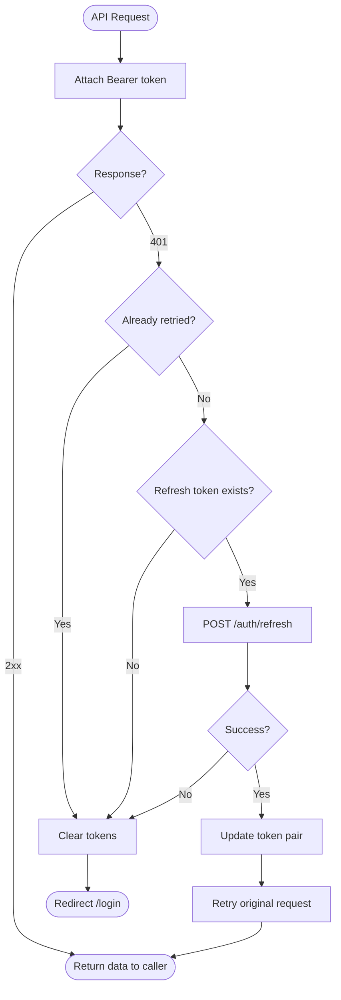
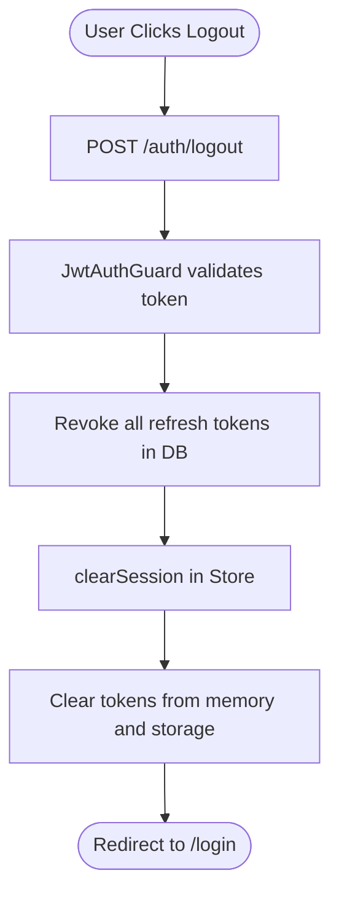

You are a senior software architect.

Your task is to analyze the authentication feature in this codebase and generate architecture diagrams that explain how the system works.

Focus specifically on the Auth flow (login, register, logout, token handling, session validation).

Steps:

1. Analyze the following layers in the Auth feature:
   - UI components
   - Hooks (custom React hooks)
   - Services (API calls / business logic)
   - Models / Types
   - External APIs or backend endpoints

2. Identify the communication flow between them.

3. Generate a SEQUENCE DIAGRAM describing the runtime interaction between:
   - User
   - UI components
   - Hooks
   - Services
   - API/backend

The sequence diagram must clearly show:
- the order of calls
- async API calls
- returned responses
- state updates

4. Then generate an ACTIVITY DIAGRAM summarizing the full authentication process.

The activity diagram should include:
- user actions
- validation
- service calls
- API communication
- success and failure branches
- UI updates

5. Use MERMAID syntax for both diagrams.

6. Output the result as Markdown with two sections:

---

# Auth Sequence Diagram

---

# Auth Activity Diagram

## Flow 1 — Session Bootstrap

## Flow 2 — Login

## Flow 3 — Silent Token Refresh

## Flow 4 — Logout

