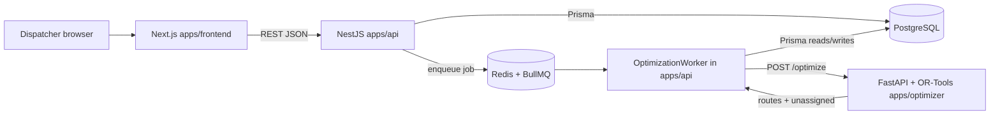
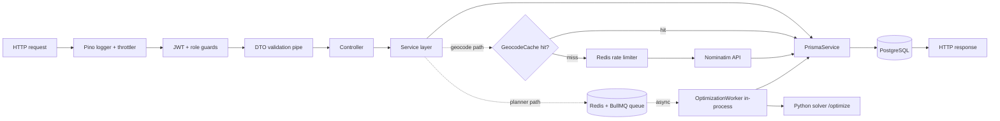

# Dispatch Route Planning System — Design Overview

## 1. Introduction

The system is a dispatch and route planning tool for daily transport operations (people or items) across Algeria. A dispatcher enters transport tasks — each a pickup at one location and a dropoff at another, with time-window constraints and optional priority — and maintains a roster of drivers with shifts and start depots. On demand, the system produces a plan for the day: an ordered sequence of pickup and dropoff stops per driver, with arrival times that respect every time window, every shift window, and the precedence requirement that a pickup must occur before its matching dropoff on the same vehicle.

Two roles use the system. The **dispatcher** is the primary user: they create and edit tasks and drivers, trigger the solver, review the proposed routes, manually adjust them if needed, publish the plan as the day's official assignment, and monitor execution through manual status check-ins. A **driver** role exists in the data model and API scaffolding but has no mobile UI in v1; status updates currently flow through the dispatcher. Outputs of the day — CSV exports and per-driver monitoring — drive the operation.

The core technical problem this document describes is **planning a set of pickup-and-dropoff tasks onto a fleet of shift-constrained drivers so that every time window is respected, every pickup precedes its own dropoff on the same vehicle, and a hierarchical objective over assignment, travel time, and travel distance is optimized**.

## 2. Assumptions and Scope

The v1 product is narrow by design. It optimizes a single day (or shift), assuming deterministic travel durations derived from great-circle distance and a configured constant speed. There is no live telematics: no GPS tracking, no mid-route re-optimization, and no automatic reaction to delays. Each driver has exactly one start depot (their own), and the end point is either the same depot or the last stop of the route (configurable via a `returnToDepot` flag). Tasks are not split, batched, or outsourced to third parties; a task is assigned to exactly one driver or remains unassigned with a reason code.

In scope (v1):

- Single-day PDPTW with pickup windows, dropoff deadlines, driver shift windows, optional vehicle capacity.
- Haversine-plus-constant-speed travel time matrix, computed fresh per solve.
- OR-Tools CP-based routing solver run as a separate FastAPI service.
- Plan review UI: move stops between drivers, reorder, lock individual stops, manually add/remove stops, recalculate ETAs.
- Plan publication and CSV export of reports.
- Manual execution status transitions (`pending → arrived → done`, or `pending → skipped`) with downstream ETA recalculation.

Out of scope (v1):

- Real road-network routing (OSRM, Valhalla) and traffic-aware travel times.
- Multi-day horizon, rolling re-optimization, zone restrictions.
- GPS tracking, live driver app, push notifications.
- Invoicing, billing, payments.
- PDF route sheets (endpoint returns `501 Not Implemented`).
- Full audit log over task, driver, and plan changes (only stop-status events are recorded).

## 3. Optimization Problem Formulation

### 3.1 Problem classification

The problem is a **Pickup and Delivery Problem with Time Windows (PDPTW)**. It generalizes the classical VRPTW by adding coupled pickup-dropoff node pairs with three additional constraints per pair: same-vehicle, pickup-before-dropoff in time, and consistent activation (both nodes assigned or both unassigned). PDPTW is NP-hard — it reduces from VRP already at zero time windows — so exact methods (branch-and-cut, set partitioning) do not scale to operational sizes within the 30-second soft performance target. The system therefore treats it as a constraint-satisfaction problem solved by local-search metaheuristics, where feasibility is enforced by the constraint model and the objective is minimized by large-neighborhood moves.

### 3.2 Sets and indices

Let

- $K$ be the set of drivers (vehicles), indexed by $k$.
- $N$ be the set of transport tasks, indexed by $n$.
- For each $n \in N$, $p_n$ is the pickup node and $d_n$ is the dropoff node.
- $P = \{p_n : n \in N\}$ is the set of pickup nodes; $D = \{d_n : n \in N\}$ is the set of dropoff nodes.
- For each $k \in K$, $o_k$ is the start depot node and $e_k$ is the end depot node (distinct indices, co-located coordinates).
- $V = \{o_k : k \in K\} \cup \{e_k : k \in K\} \cup P \cup D$ is the full node set, with $|V| = 2|K| + 2|N|$.
- $A = \{(i, j) \in V \times V : i \neq j\}$ is the arc set.

In the implementation, the node list is constructed in this exact order inside `apps/optimizer/main.py`: all start depots, then all end depots, then pickup/dropoff pairs interleaved per task.

### 3.3 Parameters

- $t_{ij} \in \mathbb{Z}_{\geq 0}$: travel time from $i$ to $j$ in seconds, computed from the Haversine distance and the configured constant speed $v$ (default $40$ km/h).
- $c_{ij} \in \mathbb{Z}_{\geq 0}$: travel distance from $i$ to $j$ in meters.
- $s_i \in \mathbb{Z}_{\geq 0}$: service time at node $i$, with $s_{o_k} = s_{e_k} = 0$.
- $[e_i, l_i]$: time window at node $i$. For pickup nodes, $[e_{p_n}, l_{p_n}]$ is taken from the task's pickup window. For dropoff nodes, $e_{d_n} = 0$ and $l_{d_n}$ is the task's dropoff deadline, so the constraint degenerates to a deadline.
- $[\alpha_k, \beta_k]$: shift window for driver $k$.
- $Q_k \in \mathbb{Z}_{\geq 0} \cup \{\infty\}$: capacity of driver $k$; $\infty$ if the driver has no capacity declared.
- $q_n \in \mathbb{Z}_{\geq 1}$: capacity demand of task $n$.
- $\rho_n \in \{10, 100, 500, 1000\}$: priority penalty for leaving task $n$ unassigned, by mapping `low → 10`, `normal → 100`, `high → 500`, `urgent → 1000`.
- $\pi: P \to D$ with $\pi(p_n) = d_n$: the pickup-dropoff pairing.

The codebase does not currently maintain a persistent travel-time matrix cache keyed by coordinates; $t_{ij}$ and $c_{ij}$ are recomputed per solve from raw lat/lng pairs. A `GeocodeCache` model exists for address-to-coordinate caching but plays no role in the matrix.

### 3.4 Decision variables

- $x_{ijk} \in \{0, 1\}$ for $(i, j) \in A$, $k \in K$: $x_{ijk} = 1$ iff driver $k$ traverses arc $(i, j)$.
- $T_{ik} \in \mathbb{R}_{\geq 0}$: arrival time at node $i$ on vehicle $k$ (well-defined only when $i$ is visited by $k$).
- $L_{ik} \in \mathbb{Z}_{\geq 0}$: cumulative load on vehicle $k$ after servicing node $i$ (defined only when the capacity dimension is active).
- $z_n \in \{0, 1\}$: $z_n = 1$ iff task $n$ is unassigned. Implemented implicitly through OR-Tools `AddDisjunction` on pickup and dropoff nodes.

The OR-Tools model does not expose $x_{ijk}$ directly; it uses `NextVar(i)` (node-valued) plus `VehicleVar(i)` (integer-valued). The formulation above is the mathematical equivalent.

### 3.5 Objective function

The product spec describes a hierarchical objective: (1) maximize the number of assigned tasks, priority-weighted; (2) minimize total travel time; (3) minimize total travel distance as a tie-breaker. The implementation collapses (1) and (3) into a weighted sum and handles (2) through a lexicographic finalizer.

Specifically, the arc cost evaluator registered via `SetArcCostEvaluatorOfAllVehicles` returns $\lceil c_{ij} / 1000 \rceil$ — distance in kilometers, rounded up. Unassigned-task penalties are attached to each pickup and dropoff node through `AddDisjunction`, split as $\lfloor \rho_n / 2 \rfloor$ on the pickup and $\lceil \rho_n / 2 \rceil$ on the dropoff. Because $(p_n, d_n)$ share an active-state constraint (see §3.6), the two halves always trigger together, so the effective per-task penalty is $\rho_n$. A global span cost coefficient of $1$ is set on a secondary `DistanceCost` dimension, adding a small pressure against route imbalance.

The minimized objective passed to the solver is therefore

$$\min \; \sum_{n \in N} \rho_n \, z_n \;+\; \sum_{k \in K} \sum_{(i,j) \in A} \left\lceil \frac{c_{ij}}{1000} \right\rceil x_{ijk} \;+\; \gamma \left(\max_k C_k - \min_k C_k\right),$$

where $C_k$ is the cumulative distance-cost on vehicle $k$ and $\gamma = 1$. With priority penalties in $[10, 1000]$ and realistic route distances typically below a few hundred kilometers, the first term dominates: maximizing the weighted number of assigned tasks is in practice the primary objective.

Travel time enters only via a secondary minimizer:

$$\text{minimize lex. after main objective: } \sum_{k \in K} T_{e_k, k},$$

implemented with `AddVariableMinimizedByFinalizer(time_dim.CumulVar(end_index))` per vehicle. This is a post-optimization finalizer, not a term in the main objective, so the spec's "minimize total travel time" ordering is approximate: distance drives the main search, time is compressed afterward by the finalizer.

### 3.6 Constraints

**(C1) Flow conservation and route structure.** Each vehicle $k$ leaves its start depot $o_k$ exactly once and arrives at its end depot $e_k$ exactly once, and at every intermediate node the number of incoming and outgoing arcs match.

$$\sum_{j \in V} x_{o_k j k} = 1, \quad \sum_{i \in V} x_{i e_k k} = 1, \quad \forall k \in K$$

$$\sum_{i \in V} x_{ihk} = \sum_{j \in V} x_{hjk}, \quad \forall h \in V \setminus \{o_k, e_k\}, \, \forall k \in K$$

**(C2) Each pickup-dropoff pair visited at most once.** A task is either fully served (both pickup and dropoff visited) or fully unassigned.

$$\sum_{k \in K} \sum_{j \in V} x_{p_n j k} = \sum_{k \in K} \sum_{j \in V} x_{d_n j k} = 1 - z_n, \quad \forall n \in N$$

Implemented via `AddDisjunction([p_n], \rho_n/2)`, `AddDisjunction([d_n], \rho_n/2)`, and `ActiveVar(p_n) == ActiveVar(d_n)`.

**(C3) Same-vehicle pickup-dropoff pairing.** Pickup and dropoff of the same task are served by the same vehicle.

$$\sum_{j \in V} x_{p_n j k} = \sum_{j \in V} x_{d_n j k}, \quad \forall n \in N, \, \forall k \in K$$

Implemented via `AddPickupAndDelivery(p_n, d_n)` and the explicit constraint `VehicleVar(p_n) == VehicleVar(d_n)`.

**(C4) Pickup-before-dropoff precedence.**

$$T_{p_n, k} \leq T_{d_n, k}, \quad \forall n \in N, \, \forall k \in K \text{ such that } n \text{ is served by } k$$

Implemented via the explicit constraint `time_dim.CumulVar(p_n) <= time_dim.CumulVar(d_n)`.

**(C5) Time-window propagation.** If driver $k$ traverses arc $(i, j)$, then $T_{jk}$ must be at least $T_{ik} + s_i + t_{ij}$:

$$x_{ijk} = 1 \implies T_{jk} \geq T_{ik} + s_i + t_{ij}, \quad \forall (i, j) \in A, \, \forall k \in K$$

Implemented as the transit callback on the `Time` dimension.

**(C6) Pickup time windows.**

$$e_{p_n} \leq T_{p_n, k} \leq l_{p_n}, \quad \forall n \in N, \, \forall k \in K$$

Implemented by `time_dim.CumulVar(pickup_index).SetRange(pickupWindowStartS, pickupWindowEndS)`.

**(C7) Dropoff deadlines.**

$$T_{d_n, k} \leq l_{d_n}, \quad \forall n \in N, \, \forall k \in K$$

Implemented by `time_dim.CumulVar(dropoff_index).SetRange(0, dropoffDeadlineS)`.

**(C8) Driver shift window.**

$$T_{o_k, k} = \alpha_k, \quad T_{e_k, k} \leq \beta_k, \quad \forall k \in K$$

Implemented by fixing the start-depot cumul var to the shift start and bounding the end-depot cumul var above by the shift end.

**(C9) Capacity (optional).** Active only if at least one driver declares a capacity; then the capacity dimension is added with demand $+q_n$ at pickup and $-q_n$ at dropoff.

$$L_{o_k, k} = 0, \quad 0 \leq L_{ik} \leq Q_k, \quad \forall i \in V, \, \forall k \in K$$

$$L_{jk} = L_{ik} + \text{demand}_j \text{ when } x_{ijk} = 1, \text{ where } \text{demand}_{p_n} = q_n, \, \text{demand}_{d_n} = -q_n$$

In the current worker, every task is passed to the solver with `capacityUnits: 1` regardless of the task's declared demand — the demand field on `Task` exists in the Prisma schema but is not wired through to the solver call.

**(C10) Depot behavior.** Start at the assigned depot is mandatory. Return to depot is controlled by the `returnToDepot` config flag: when `false`, the arc cost and time from any node into the end depot is forced to zero, effectively letting the route terminate at its last real stop without penalty.

## 4. Solution Approach

### 4.1 Framework

The solver is built on **OR-Tools `pywrapcp`**, the Python interface to Google's constraint-programming routing layer. A metaheuristic-backed constraint solver is the right tool for PDPTW at operational scale: exact MIP formulations (Miller-Tucker-Zemlin, time-indexed) explode past a few dozen tasks; the OR-Tools routing model natively supports the two constraint families that matter here — time dimensions with cumul-var windowing, and pickup-delivery pairs with same-vehicle and precedence — and its guided-local-search metaheuristic reliably produces feasible, high-quality solutions within single-digit seconds on the daily volumes the system targets.

The search configuration in `apps/optimizer/main.py`:

- First-solution strategy: `PATH_CHEAPEST_ARC` — cheap greedy construction.
- Metaheuristic: `GUIDED_LOCAL_SEARCH` — escapes local optima through penalty augmentation on frequently used arcs.
- Time limit: `config.maxSolveSeconds` (default 30), from the `Config` row in Postgres.
- Deterministic configuration: `random_seed = 0`, `number_of_workers = 1`.

### 4.2 How OR-Tools models this problem

- `RoutingIndexManager(total_nodes, num_drivers, starts, ends)` fixes the node index space, with per-vehicle `starts` and `ends` arrays so each driver has a distinct start depot and a distinct end depot.
- `RoutingModel` is built on top of the manager; `solver()` exposes the underlying CP solver for adding raw constraints.
- Two transit callbacks are registered: `distance_callback` (meters, used internally and as the arc cost scaled to km) and `time_callback` (service time at the source node plus travel time to the destination).
- A `Time` dimension is added with horizon `max(24 * 3600, max_shift_end, max_task_time)` and `fix_start_cumul_to_zero = False`, which is what permits per-vehicle start windows and per-node time-window narrowing via `CumulVar(index).SetRange(e_i, l_i)`.
- A `Capacity` dimension is added conditionally (only when any driver declares capacity), with per-vehicle capacities passed to `AddDimensionWithVehicleCapacity`.
- A secondary `DistanceCost` dimension (unit is km via the rounded-up callback) carries `SetGlobalSpanCostCoefficient(1)` to apply mild balancing pressure across vehicles.
- For each task, `AddPickupAndDelivery(p_n, d_n)` plus `VehicleVar(p_n) == VehicleVar(d_n)` plus `CumulVar(p_n) <= CumulVar(d_n)` plus `ActiveVar(p_n) == ActiveVar(d_n)` enforce the pickup-delivery contract.
- `AddDisjunction([p_n], penalty/2)` and `AddDisjunction([d_n], penalty/2)` allow a task to be dropped at the priority-weighted penalty, implementing the "maximize assigned tasks" objective as a weighted-sum relaxation of a hard constraint.

### 4.3 Solver I/O contract

The solver exposes `POST /optimize`, `GET /health`, `GET /optimizer/health`. The `/optimize` request and response shapes (verbatim from the Pydantic models and the response dict):

```python
# Request
{
  "jobId": str,
  "config": {
    "maxSolveSeconds": int,       # default 30
    "speedKmh": float,            # default 40
    "returnToDepot": bool         # default False
  },
  "drivers": [
    {
      "id": str,
      "shiftStartS": int,         # seconds since midnight
      "shiftEndS": int,
      "depotLat": float,
      "depotLng": float,
      "capacityUnits": int | None
    }
  ],
  "tasks": [
    {
      "id": str,
      "priority": "low" | "normal" | "high" | "urgent",
      "pickupLat": float, "pickupLng": float,
      "pickupWindowStartS": int, "pickupWindowEndS": int,
      "pickupServiceS": int,
      "dropoffLat": float, "dropoffLng": float,
      "dropoffDeadlineS": int, "dropoffServiceS": int,
      "capacityUnits": int        # >= 1
    }
  ]
}

# Response
{
  "jobId": str,
  "status": "completed" | "failed",
  "routes": [
    {
      "driverId": str,
      "stops": [
        { "taskId": str, "type": "pickup"|"dropoff",
          "sequence": int, "arrivalS": int, "departureS": int }
      ],
      "totalDistanceM": int,
      "totalTimeS": int
    }
  ],
  "unassigned": [
    { "taskId": str, "reason": "NO_DRIVER_AVAILABLE" | "TIME_WINDOW_INFEASIBLE"
                              | "CAPACITY_EXCEEDED" | "SOLVER_TIMEOUT" }
  ]
}
```

The unassigned-reason classification is heuristic: when the solver drops a task, the service post-processes it in `_unassigned_reason(...)` by checking driver availability, shift/time-window overlap, and capacity against task demand.

## 5. Data Model

The bridge from the domain model to the solver is straightforward: one `Task` row becomes two solver nodes, one `Driver` row becomes one vehicle with two nodes.

| Domain entity (Prisma) | Solver representation | Notes |
|---|---|---|
| `Driver` | One vehicle $k$, with start node $o_k$ and end node $e_k$ (co-located at `depotLat, depotLng`) | Shift `shiftStart/shiftEnd` strings (`HH:MM`) converted to seconds since midnight; overrides pulled from `Availability` for that date |
| `Task` | Pickup node $p_n$ at `pickupLat/Lng`, dropoff node $d_n$ at `dropoffLat/Lng`, paired via `AddPickupAndDelivery` | `pickupWindow*` → `[e_{p_n}, l_{p_n}]`; `dropoffDeadline` → $l_{d_n}$; `priority` → $\rho_n$ |
| `Plan` | Output container — created after the solver returns | Status starts as `draft`; transitions to `published` through the publish endpoint |
| `Route` | One per vehicle that receives at least one stop | `totalDistanceM`, `totalTimeS` echoed from solver response |
| `Stop` | Each entry in `route.stops` from the solver response | `etaS = arrivalS`; `departureS` clamped to `max(solverDeparture, eta + serviceSeconds)` |
| `OptimizationJob` | Tracks a single solve; stores the full solver request/response snapshots in `requestSnapshot`/`resultSnapshot` JSON columns | Used by the reports service to re-derive the unassigned-reason histogram |
| `StopEvent` | Immutable append-only log of stop status changes | The only audit-style log present in v1 |

Travel-time matrices are not persisted. Each solve recomputes the full $|V| \times |V|$ Haversine distance and time tables inside the Python service. The NestJS side has its own Haversine provider (`apps/api/src/routing/haversine.provider.ts`) used for the post-publish ETA recalculation triggered by manual stop status updates; it runs outside the solver and uses the same constant-speed assumption.

## 6. Software Architecture

### 6.1 Stack

| Component | Purpose | Why |
|---|---|---|
| Nx (pnpm workspace) | Monorepo tooling for TypeScript apps (API, frontend); Python solver lives alongside | Shared tooling and dependency graph across apps without splitting into separate repos |
| NestJS (`apps/api`) | REST API, auth, planning orchestration, Prisma access, BullMQ producer and worker, manual plan editing, reports | Opinionated modular structure; first-class DI, guards, and queue integration |
| Next.js (`apps/frontend`) | Dispatcher and admin UI (App Router); login, task CRUD, plan review, monitor, availability, admin config | SSR-capable React framework with file-based routing and mature auth patterns |
| Python + FastAPI (`apps/optimizer`) | OR-Tools solver service; exposes `POST /optimize`, `GET /health` | OR-Tools' best bindings are Python; FastAPI is lightweight and typed |
| OR-Tools (`ortools.constraint_solver.pywrapcp`) | PDPTW modeling and search (guided local search) | Native pickup-delivery + time-window support; free; state-of-the-art for VRP/PDPTW |
| PostgreSQL + Prisma | Primary datastore: drivers, tasks, plans, routes, stops, jobs, config, geocode cache | Reliable relational store; Prisma gives type-safe queries and migrations |
| Redis + BullMQ | Job queue between the API (HTTP producer) and the optimization worker; also holds the solver job lifecycle state | Decouples the 30-second solve from the HTTP request; survives restarts and retries |
| `@nestjs/jwt` + `@nestjs/passport` | JWT-based auth with refresh tokens (`RefreshToken` model); roles: `ADMIN`, `DISPATCHER` | Standard stateless auth; refresh tokens avoid long-lived access tokens |
| `nestjs-pino` + `@nestjs/throttler` | Structured logging and API rate limiting | Production-grade observability and abuse protection with minimal wiring |
| Haversine matrix provider (in-process) | Travel distance/time matrix in the NestJS recalculation path, and inside the Python solver — no external routing engine is wired in v1 | Zero dependencies, instant computation; placeholder until OSRM/Valhalla is added |

The spec lists OSRM or Valhalla as the target routing engine, and a `libs/routing` with caching as the place it would live. The `libs/` directory in the repo is empty; routing is a plain Haversine provider registered through `apps/api/src/routing/routing.module.ts`.

### 6.2 Service diagram



### 6.3 Monorepo layout

```text
.
|-- apps/
|   |-- api/                 # NestJS backend: auth, planning, workers, Prisma
|   |   |-- prisma/          # schema.prisma, migrations
|   |   |-- src/
|   |       |-- admin/       # admin/config endpoints
|   |       |-- auth/        # JWT auth, refresh tokens, guards
|   |       |-- availability/# per-driver per-date availability overrides
|   |       |-- driver-app/  # scaffolding for future driver UI (no mobile app yet)
|   |       |-- drivers/     # driver CRUD
|   |       |-- geocode/     # geocode service + GeocodeCache
|   |       |-- planning/    # core planning: service, controllers, worker, queue
|   |       |-- prisma/      # PrismaService wrapper
|   |       |-- redis/       # Redis client for BullMQ
|   |       |-- routing/     # Haversine matrix provider
|   |       |-- tasks/       # task CRUD
|   |-- frontend/            # Next.js admin/dispatcher UI (App Router)
|   |   |-- src/app/
|   |       |-- admin/       # admin pages: drivers, config, audit view
|   |       |-- dispatcher/  # tasks, planning, monitor, availability, reports
|   |       |-- driver/      # placeholder driver view
|   |       |-- login/       # auth UI
|   |-- optimizer/           # Python FastAPI + OR-Tools service
|   |   |-- main.py          # single-file solver: /optimize, /health
|   |   |-- tests/           # solver unit tests
|   |-- backend/             # legacy/secondary backend folder present in tree
|-- libs/                    # empty in v1 (spec called for domain, routing, ui libs)
|-- docs/                    # specs and design docs including this one
|-- infra/                   # infra manifests
|-- docker-compose.yml       # local stack: postgres, redis, api, optimizer, frontend
```

### 6.4 Run Planner lifecycle

```mermaid
sequenceDiagram
  participant D as Dispatcher (browser)
  participant W as Next.js frontend
  participant A as NestJS API
  participant Q as Redis/BullMQ
  participant Wk as OptimizationWorker
  participant DB as Postgres
  participant S as FastAPI solver

  D->>W: Click "Run Planner" for date
  W->>A: POST /dispatcher/planning/optimize { date, returnToDepot }
  A->>DB: count pending tasks, active drivers, load Config
  A->>DB: INSERT OptimizationJob (status=queued)
  A->>Q: add('optimization', { jobId, date, returnToDepot })
  A-->>W: 202 { jobId, status=queued, estimatedTimeSeconds }

  W->>A: GET /dispatcher/planning/status/:jobId (poll)
  Q-->>Wk: job dequeued
  Wk->>DB: UPDATE job status=running, startedAt, progress=10
  Wk->>DB: SELECT drivers, tasks, availability overrides
  Wk->>Wk: map to optimizer payload (times in seconds)
  Wk->>S: POST /optimize (payload)
  S->>S: build nodes, Haversine matrix, OR-Tools model, GLS search
  S-->>Wk: { routes, unassigned, status }
  Wk->>DB: TX: insert Plan + Routes + Stops; set Task.status=assigned; job completed, resultSnapshot
  Wk-->>Q: job done

  W->>A: GET /dispatcher/planning/plans/:planId (once status=completed)
  A->>DB: SELECT plan + routes + stops + unassigned (from resultSnapshot)
  A-->>W: plan detail
  W-->>D: render routes (table + map + timeline)
```

### 6.5 Third-party services

Only a minimal set of external services is used in v1. Everything related to the solver, travel-time matrix, database, queue, and auth is self-hosted or runs in-process. External calls are limited to address search (geocoding) and map tile rendering, both via OpenStreetMap's public infrastructure.

| Service | Used for | Endpoint / library | Hosting | Notes |
|---|---|---|---|---|
| **Nominatim** (OpenStreetMap geocoder) | Address → lat/lng lookup when creating tasks/drivers | `https://nominatim.openstreetmap.org/search` (overridable via `NOMINATIM_URL`) | Public OSM instance by default; can be swapped for a self-hosted Nominatim | Called from `apps/api/src/geocode/geocode.service.ts`; results cached in `GeocodeCache` (Postgres) for 7 days; Redis-based 1 req/sec rate limiter to respect OSM usage policy |
| **OpenStreetMap tile server** | Map background tiles in the dispatcher UI | `https://{s}.tile.openstreetmap.org/{z}/{x}/{y}.png` (raster tiles) | Public OSM tile servers | Used by `apps/frontend/src/components/map/MapView.tsx` through `react-leaflet`; no API key required; subject to OSM tile usage policy |
| **Leaflet + react-leaflet** | In-browser map rendering library | `leaflet@^1.9.4`, `react-leaflet@^5.0.0` | Client-side JS library (not a service) | Renders markers, routes, and tiles; no server component |
| **OSRM / Valhalla** | Real road-network routing and travel-time matrix | — | — | **Not used in v1.** Spec target; Haversine + constant speed is the current placeholder |
| Google Maps / Mapbox / any paid map API | — | — | — | **Not used.** Design explicitly avoids per-call paid APIs for cost and sovereignty reasons |
| SMS / push notification / email provider | — | — | — | **Not used in v1.** Driver notifications are out of scope |

**Key points.** The system is deliberately **OpenStreetMap-first and self-host-ready**: every external dependency in the table can be swapped for a self-hosted instance by changing an env var (`NOMINATIM_URL`, a future `OSRM_URL`, a custom tile server URL). No vendor lock-in, no pay-per-call service on the critical path, and no API keys required to run the v1 stack end-to-end.

### 6.6 Backend Flow Explanation

A typical HTTP request entering the NestJS backend passes through a short stack of infrastructure before reaching any business logic. The request is first logged by a Pino-based middleware and metered by the global throttler for rate limiting. It then hits a JWT authentication guard that validates the bearer token against the `User` and `RefreshToken` state in Postgres, followed by a role-based authorization guard that checks whether the caller holds the required role (Admin or Dispatcher). A class-validator pipe enforces the shape of the request body against the endpoint's DTO, rejecting malformed input before the controller method is invoked. The controller is a thin dispatcher: it forwards the parsed, validated, authorized call into a service. The service layer owns the business logic — cross-entity reads, transactional writes, derived calculations — and accesses the database exclusively through PrismaService, which issues SQL against Postgres. Responses flow back up the same stack and are serialized to JSON. The majority of endpoints in the codebase — tasks, drivers, availability, plans, stops, reports — complete entirely within this synchronous path and never make outbound network calls.

Two endpoint families step outside this pattern. **Geocoding** makes a synchronous outbound HTTP call to Nominatim, but only on cache misses: the service first consults the `GeocodeCache` table in Postgres for a recent result, and only on a miss does it acquire a Redis-backed one-second rate-limit token, issue the Nominatim request, persist the result back to the cache, and respond. The **planner** endpoint is the most significant deviation: it is queue-mediated rather than synchronous. The controller validates inputs, inserts an `OptimizationJob` row, enqueues a payload onto a BullMQ queue backed by Redis, and returns `202 Accepted` with a job id — no solver call is made on the request path itself. A BullMQ worker running inside the same NestJS process consumes the queue out-of-band, reloads drivers and tasks from Postgres, and issues an outbound HTTP POST to the Python solver service. When the solver responds, the worker persists the resulting plan, routes, and stops in a single transaction and marks the job complete. The client discovers completion by polling a separate status endpoint that reads the job row directly from Postgres. Note one deliberate absence: there is no outbound call to a routing engine — the travel-time matrix is computed in-process via Haversine inside the solver itself — so "routing engine" is not a node in the diagram below.



## 7. Limitations and Future Work

The v1 system has four deliberate simplifications that are already the main axes of future work.

**Travel times.** The Haversine-plus-constant-speed matrix ignores road networks, one-way streets, detours, and traffic. In a city like Algiers it will under-estimate travel times systematically. The spec calls for OSRM or Valhalla; the abstraction is thin (a `RoutingMatrixProvider` contract in `apps/api/src/routing` and a matrix builder inside `apps/optimizer`). Swapping in an engine is a self-contained piece of work.

**Static planning.** The solver runs once per plan; there is no mid-day re-optimization when a driver falls behind or a new urgent task arrives. Stop status updates only trigger a *recalculation* of downstream ETAs along an unchanged route, not a re-assignment. A future mid-route re-optimization would reuse the same solver endpoint with frozen (locked) stops carried forward.

**No live driver signal.** Execution monitoring is driven by dispatcher check-ins. Once a driver app exists, the same `PATCH /dispatcher/stops/:stopId/status` surface can be fed by the driver, and `StopEvent` becomes the source of truth for "where is driver $k$ right now" without a schema change.

**Single day, single depot, single plan per day.** The `Plan` model is date-keyed and the worker scopes its task query to `pickupWindowStart` within a day. Multi-day planning, zone restrictions, and multiple depots per driver all require schema and solver changes.

Architectural hooks already in place: the separation between the NestJS worker and the Python solver means the solver can be replaced or extended (VROOM, OptaPlanner) without touching the API; `OptimizationJob.requestSnapshot` and `resultSnapshot` preserve full solver traces for offline analysis; and the plan-review edit operations (move, lock, add, delete, recalculate) are already on a separate controller (`manual-planning.controller.ts`), decoupled from the automatic solve path.

## 8. Spec vs Implementation Gaps

- **Routing engine.** Spec: OSRM or Valhalla, self-hosted, with matrix caching in `libs/routing`. Code: Haversine with constant speed (`apps/optimizer/main.py`, `apps/api/src/routing/haversine.provider.ts`); no matrix cache; `libs/` is empty. **Simplification**, deferred to v2.
- **Task state machine.** Spec: `Draft → Planned → Published → In Progress → Completed` (+ `Cancelled`). Code: `TaskStatus` enum has only `pending`, `assigned`, `cancelled`; the `Stop.status` enum (`pending/arrived/done/skipped`) carries the execution-side states, so the full lifecycle is split across two tables. **Deliberate change**.
- **Plan status.** Spec: `draft → planned → published`. Code: `PlanStatus` is `draft | published` only; there is no intermediate `planned` state. **Simplification**.
- **Audit log.** Spec: immutable versioned plans and a full audit log over all edits. Code: only `StopEvent` (stop-status changes) is recorded; task, driver, plan, and config edits have no audit trail; the admin audit page in the frontend uses mock data. **Deferred feature**.
- **PDF export.** Spec: per-driver PDF route sheets for field use. Code: the endpoint returns `501 Not Implemented`. CSV export is implemented. **Deferred feature**.
- **Task contact field.** Spec: required contact on each task. Code: not in `schema.prisma`. **Deferred field**.
- **Driver end depot.** Spec: optional end depot distinct from start, or "free end". Code: single `depotLat/Lng`; the "free end" case is approximated by zeroing the return leg when `returnToDepot=false`. **Simplification**.
- **Driver app.** Spec: optional mobile UI for drivers to update stop status. Code: `apps/api/src/driver-app` scaffolding exists; no client UI. **Deferred feature**.
- **Violation-blocked publish.** Spec: publishing is blocked when the plan has time-window or shift violations. Code: publish transitions draft → published with no violation check beyond status. **Deferred safety check**.
- **Capacity plumbing.** Spec: optional capacity per task. Code: the solver supports it fully, but the worker hardcodes `capacityUnits: 1` per task (`apps/api/src/planning/optimization.worker.ts`), so task-level demand from Prisma is ignored end-to-end. **Implementation gap**.
- **Objective ordering.** Spec: strict lexicographic — (1) maximize assigned, (2) minimize time, (3) minimize distance. Code: weighted-sum on (assigned penalty, distance-km), with time minimized only as a finalizer. In practice the large priority penalties make assigned-task count dominate the search, but the travel-time ordering relative to distance is not what the spec specifies. **Deliberate simplification driven by OR-Tools idioms**.
- **Libs and shared types.** Spec: `libs/domain`, `libs/routing`, `libs/ui`. Code: `libs/` is empty; shared types live in `apps/api` and are duplicated on the frontend side. **Deferred refactor**.
- **Traffic / time-of-day multipliers.** Spec: optional rush-hour factors on travel time. Code: none; constant speed. **Deferred feature**.

## 9. Concepts, Walkthroughs, and Worked Examples

This section collects the explanatory material that accompanied the design review: definitions, plain-language restatements of the math, worked examples, and clarifications on how the algorithm behaves in practice. It is meant as an informal companion to sections 3 and 4 for readers who want the intuition alongside the formalism.

### 9.1 Terminology quick reference

- **PDPTW** — Pickup and Delivery Problem with Time Windows.
- **VRP** — Vehicle Routing Problem. PDPTW is a specialization where each job has a coupled pickup and dropoff.
- **VRPTW** — Vehicle Routing Problem with Time Windows. PDPTW extends VRPTW by adding the pickup-dropoff pairing constraints.
- **CP-SAT** — Google OR-Tools' general-purpose Constraint Programming solver built on a SAT engine. Distinct from the Routing Library used here; CP-SAT is lower-level and more flexible, the Routing Library is a higher-level PDPTW/VRP-specialized wrapper.

### 9.2 Windows, in plain language

There are **two time windows per task** and **one per driver**:

1. **Pickup window** $[e_{p_n}, l_{p_n}]$ — earliest and latest time the driver may start the pickup (a range, e.g. 09:00–10:30). Arriving early means waiting; arriving late is forbidden.
2. **Dropoff deadline** $l_{d_n}$ — latest time the delivery must be completed. No earliest time (a degenerate window with $e_{d_n} = 0$).
3. **Shift window** $[\alpha_k, \beta_k]$ — driver $k$'s working hours. Every arrival time on the route must lie inside this range.

### 9.3 The node set V, visualized

The solver builds one node list combining four groups:

1. **Start depots** — one per driver.
2. **End depots** — one per driver.
3. **Pickup nodes** $P$ — one per task.
4. **Dropoff nodes** $D$ — one per task.

Count: $|V| = 2|K| + 2|N|$. Example with 3 drivers and 10 tasks: $2(3) + 2(10) = 26$ nodes (3 start depots + 3 end depots + 10 pickups + 10 dropoffs).

The start depot and a pickup node are not the same thing: the **start depot** is where the driver begins their shift (one per driver); a **pickup node** is where a task is collected (one per task). A route always looks like: start depot $\to$ pickup $\to$ dropoff $\to$ pickup $\to$ dropoff $\to \dots \to$ end depot.

### 9.4 What $x_{ijk}$ stands for

A binary variable that equals **1 if driver $k$ travels directly from node $i$ to node $j$**, and 0 otherwise.

### 9.5 Why Haversine in v1

**Haversine distance** is the great-circle distance between two lat/lng points on a sphere — the "as the crow flies" distance that accounts for Earth's curvature. It is used in v1 because:

- **Simplicity** — a pure math formula, no external service, no API keys, no network calls.
- **Speed** — the full $|V| \times |V|$ matrix computes in milliseconds.
- **Zero cost** — no need to self-host OSRM/Valhalla, no pay-per-call service.

Trade-off: Haversine ignores roads. It assumes straight-line travel, which is never true in real cities. The system compensates crudely by assuming a constant speed of 40 km/h and computing `travel_time = haversine_distance / 40 km/h`. This systematically **under-estimates** real travel time in urban settings and is flagged as the #1 v1-to-v2 gap.

### 9.6 Why the v1 objective collapses: time and distance under constant speed

Under the constant-speed assumption, minimizing total travel time and minimizing total travel distance are **mathematically equivalent**: $\text{time} = \text{distance} / v$ with $v$ constant, so a plan that is shorter in distance is proportionally shorter in time. The spec's hierarchy (assign > time > distance) therefore collapses to (assign > distance), with the time finalizer doing the limited work of compressing schedule slack rather than re-choosing routes.

**Service time** is the small exception: each task has configurable `pickupServiceMinutes` and `dropoffServiceMinutes` that add to route duration without adding to distance. So two plans with equal distance can differ in total time. But since service times are fixed per task and the solver cannot reduce them by rerouting, this does not give the finalizer new alternative structures to choose between — only timeline compression within a fixed structure.

**Why keep the separation in v1.** Once OSRM or Valhalla replaces Haversine, $t_{ij}$ and $c_{ij}$ become genuinely independent (a 10 km highway segment and a 10 km downtown segment have very different durations). The current modeling — separate `Time`, `DistanceMeters`, and `DistanceCost` dimensions — is already shaped for that world. Swapping the matrix provider activates the full hierarchy without formulation changes.

### 9.7 The ten constraints, in plain words

| | Constraint | Plain statement |
|---|---|---|
| C1 | Flow conservation | A driver's route is a continuous path from start depot through stops to end depot. No teleporting. |
| C2 | Task is all-or-nothing | Either both pickup and dropoff happen, or neither does. No half-served tasks. |
| C3 | Same driver for pickup and dropoff | The driver who picks up a task must also deliver it. No mid-route handoffs. |
| C4 | Pickup before dropoff | You must pick something up before you can drop it off. |
| C5 | Time adds up along the route | Arrival time at any stop = previous stop's departure + travel time to this stop. |
| C6 | Pickup time window | The driver must arrive at each pickup within its allowed time range. |
| C7 | Dropoff deadline | Each delivery must complete before its deadline. |
| C8 | Driver shift hours | A driver only works during their shift window. |
| C9 | Capacity (optional) | Load on board never exceeds vehicle capacity. |
| C10 | Depot rules | Every driver starts at their own depot. Returning at the end is optional (`returnToDepot` flag). |

Mentally grouped: **route shape** (C1, C10), **task integrity** (C2, C3, C4), **physical reality** (C5, C6, C7, C8, C9).

### 9.8 Why OR-Tools pywrapcp (Routing Library), not alternatives

| Tool | Why not chosen |
|---|---|
| Gurobi / CPLEX | Commercial, expensive licenses. Exact MIP methods do not scale past ~50 tasks for PDPTW. You'd end up writing metaheuristics on top. |
| VROOM (C++) | Open-source, very fast, VRP-focused. But weaker PDPTW support (pickup-delivery is a newer addition), smaller community. Spec lists as a future alternative. |
| OptaPlanner (Java) | Flexible constraint solver, but JVM-only, heavier deployment, more hand-rolled PDPTW setup. |
| jsprit (Java) | Dedicated VRP library, but JVM-only, smaller ecosystem. |
| Self-written MIP or custom metaheuristic | Months of development, not competitive on time-to-solution for operational problems. |

OR-Tools was chosen because: native PDPTW support (`AddPickupAndDelivery`, time dimensions, disjunctions for soft assignment), free and open-source (Apache 2.0), production-proven at scale, and Python bindings that keep the solver a small FastAPI service. It is chosen because it is the **best fit for this specific problem**, not because it is the most famous generic optimizer. Note: OR-Tools `pywrapcp` has been largely superseded for general-purpose CP by CP-SAT, but the Routing Library on top of `pywrapcp` remains state-of-the-art for VRP/PDPTW and complex local search — so it is still the right choice here.

### 9.9 How the algorithm works — three phases

OR-Tools does not derive an optimal solution. It **builds a plausible solution fast, then improves it by trial and error until time runs out**. The pipeline is three phases:

```
Phase 1: Construction  →  Phase 2: Local Search  →  Phase 3: Finalization
"Get any valid plan"       "Make it better"           "Polish the timing"
```

#### 9.9.1 Phase 1 — Greedy construction (`PATH_CHEAPEST_ARC`)

**Goal:** build any feasible starting solution, fast.

**Core loop (global competition, not per-driver):**

```
Initialize:
  For each driver k, current_position[k] = depot_start[k]
  route[k] = [depot_start[k]]
  current_time[k] = shift_start[k]

Repeat until no feasible arc exists:
  best_arc = None
  best_cost = infinity

  For each driver k (not yet finished):
      For each unvisited candidate node j that is feasible
      given driver k's route so far (time windows, shift, capacity, precedence):
          cost = distance(current_position[k], j)     # arc cost only
          if cost < best_cost:
              best_cost = cost
              best_arc = (driver k, node j)

  Add best_arc.j to route[best_arc.k]
  current_position[best_arc.k] = best_arc.j
  update current_time[best_arc.k]
```

**Key properties:**

- Greedy considers **all drivers simultaneously** at every step, not one driver at a time. The cheapest arc across the entire fleet wins.
- "Cost" at this stage is **only arc distance** (in km), not the full objective. Unassignment penalties and span balance are ignored during construction.
- **Feasibility filter** discards candidates that would violate any constraint: pickup window, dropoff deadline, shift end, capacity, or precedence.
- Greedy is **myopic**: it picks the locally cheapest arc without looking ahead.

**What Phase 1 produces:** a complete, valid plan. Some tasks may be unassigned if no driver can feasibly take them under the current partial route state; those tasks go into the "unassigned bucket" and are handled by Phase 2 through reshuffling.

#### 9.9.2 Phase 2 — Local search with Guided Local Search

**Goal:** take the greedy solution and improve it against the full objective.

**Core loop:**

```
current_solution = phase_1_output
best_solution    = current_solution

while time_remaining > 0:
    neighbors = generate_candidate_moves(current_solution)
    best_neighbor = argmin(score(n) for n in neighbors)

    if score(best_neighbor) < score(current_solution):
        current_solution = best_neighbor
    else:
        current_solution = escape_local_minimum()   # GLS penalty augmentation

    if score(current_solution) < score(best_solution):
        best_solution = current_solution

return best_solution
```

**Neighbor operators tried:**

| Operator | What it does |
|---|---|
| Relocate | Move a stop from one position to another (possibly another driver) |
| Exchange | Swap two stops |
| 2-opt | Reverse a segment of a route |
| Or-opt | Move a chain of 2–3 consecutive stops elsewhere |
| Cross-exchange | Swap segments between two drivers |
| Make-inactive | Drop a task (pay the penalty, free up time) |
| Make-active | Insert a previously-unassigned task |

Every candidate neighbor is scored with the **full objective** (unassignment penalty + arc distance + span cost). Infeasible neighbors (constraint violations) are discarded before scoring.

**Why Guided Local Search.** Plain local search gets stuck in local minima — positions where every small change makes the plan worse but the plan still isn't globally great. GLS penalizes frequently-used features (arcs appearing often in the current solution), forcing the solver to explore alternatives. When the solver escapes the current basin, the penalties relax.

**Stopping rule.** Phase 2 is **wall-clock bounded** by `maxSolveSeconds` (default 30s). No convergence test — GLS never truly converges because it keeps injecting perturbations. Time-bounded is simpler and predictable for operations. Within 30 seconds, the solver typically attempts tens of thousands to millions of candidate moves.

**Quality vs. budget.** Roughly:

| `maxSolveSeconds` | Behavior |
|---|---|
| 1 | Barely past greedy; rough plan |
| 5 | Basic local improvements |
| 30 (default) | Several local-minima escapes; good quality |
| 120 | Diminishing returns; mostly polishing |
| 600 | Marginal improvement |

#### 9.9.3 Phase 3 — Timeline finalizer

**Goal:** compress the schedule of the fixed route without changing assignments, drivers, or order.

The main objective (Phase 2) handles goals 1 and 3 (assignment + distance). Phase 3 handles goal 2 (travel time) as a secondary pass. It does **not** reshape the plan — all structural choices are frozen.

Implementation:

```python
routing.AddVariableMinimizedByFinalizer(time_dim.CumulVar(end_index))
```

Effect: for each driver, the finalizer pushes start times forward to eliminate unnecessary waiting at the first stop. The driver clocks in later, arrives at their first pickup exactly when its window opens, and starts working immediately — no useless idle time at the beginning of the shift.

What shrinks and what doesn't:

- **Early-morning wait** (driver arrives before the first window opens) → removable by starting later.
- **Mid-day gap** (window X ends, window Y opens hours later) → stays. Nothing else to do in between.
- **End-of-day slack** → absorbed where possible into earlier finishing.

### 9.10 Worked example: time tracking along a route

Setup: Bob's shift is 08:00–17:00. Tasks and travel legs from his depot outward.

| Step | Event | Clock |
|---|---|---|
| 0 | At depot, shift begins | 08:00 |
| 1 | Drive to $p_A$, 30 min | 08:30 |
| 2 | Window $p_A$ is 09:00–10:00, wait 30 min | 09:00 |
| 3 | Service $p_A$, 10 min | 09:10 |
| 4 | Drive to $d_A$, 20 min | 09:30 |
| 5 | Service $d_A$, 5 min (deadline 11:00 ✓) | 09:35 |
| 6 | Drive to $p_2$, 15 min | 09:50 |
| 7 | Window $p_2$ is 16:00–16:30, wait 370 min | 16:00 |
| 8 | Service $p_2$, 10 min | 16:10 |
| 9 | Drive to $d_2$, 30 min (deadline 18:00 ✓) | 16:40 |
| 10 | Service $d_2$, 5 min | 16:45 |
| 11 | Would return to depot, 20 min → 17:05 > shift end 17:00 → **infeasible** | |

This illustrates: (a) the driver's clock is a cumulative variable that grows along the route; (b) the shift window is a fixed boundary, not a counter that "shrinks"; (c) waiting is allowed, lateness is forbidden; (d) constraint violations (step 11) are detected during candidate evaluation and make the move infeasible.

### 9.11 Worked example: two tasks on one driver — connecting arc

Setup: Bob's shift starts 09:30. Task A window 10:00–13:00, Task B window 14:00–16:00.

Travel and service times:

- Depot $\to p_A$: 20 min, service 10 min
- $p_A \to d_A$: 30 min, service 10 min
- $d_A \to p_B$: **45 min** (the connecting arc between the two tasks)
- $p_B \to d_B$: 20 min, service 10 min at $p_B$, 10 min at $d_B$

Timeline:

| Step | Event | Clock |
|---|---|---|
| 0 | Depot | 09:30 |
| 1 | Travel to $p_A$ | 09:50 |
| 2 | Wait until window opens | 10:00 |
| 3 | Service $p_A$ | 10:10 |
| 4 | Travel to $d_A$ | 10:40 |
| 5 | Service $d_A$ (deadline 13:00 ✓) | 10:50 |
| 6 | **Travel $d_A \to p_B$, 45 min** | 11:35 |
| 7 | Wait until B window opens | 14:00 |
| 8 | Service $p_B$ | 14:10 |
| 9 | Travel to $d_B$ | 14:30 |
| 10 | Service $d_B$ (deadline 16:00 ✓) | 14:40 |

**Key points:**

- Bob does **not** return to the depot between tasks A and B. He drives directly from $d_A$ to $p_B$. The depot is visited only at the start (and optionally at the end).
- The $d_A \to p_B$ transition is counted as a regular arc in the time callback: `service_time_at_d_A + travel_time(d_A, p_B)`. Its 45 minutes of travel is fully included.
- If the connecting arc were, say, 4 hours instead of 45 minutes, Bob would arrive at $p_B$ at 14:50 — past the 14:00 window close — and the combination would be **infeasible** for Bob. The solver would assign B to a different driver or leave it unassigned.

### 9.12 Worked example: greedy myopia and Phase 2 rescue

Setup: 2 drivers (Bob at depot $D_A$, Sam at depot $D_B$), 1 task A that happens to be near Bob, 1 task B that happens to be near Sam.

Distances:

| | $p_A$ | $p_B$ |
|---|---|---|
| $D_A$ (Bob) | 2 km | 20 km |
| $D_B$ (Sam) | 15 km | 3 km |

Also: $d_A \to p_B$ = 2 km (geographic proximity after A is delivered).

**Phase 1 (greedy) behavior:**

- Iteration 1: global cheapest arc is $(D_A, p_A) = 2$ km → Bob takes $p_A$.
- Iteration 2: Bob at $p_A$, Sam still at $D_B$. $(Bob, d_A) = 5$ km vs. $(Sam, p_B) = 3$ km → Sam takes $p_B$. Good.
- Alternative scenario: if $(Bob, d_A \to p_B) = 2$ km happens to be the cheapest at some iteration, greedy chains Bob: $D_A \to p_A \to d_A \to p_B \to d_B$. Sam stays idle. **Greedy commits without noticing that Sam sitting idle is a globally worse outcome.**

**Phase 2 rescue:**

After Phase 1 produces the unbalanced plan, the **relocate** operator tries moving $p_B$ and $d_B$ from Bob's route into Sam's. The candidate move is scored under the full objective:

- Distance: likely rises slightly (Sam drives the 3 km depot-to-$p_B$ arc; Bob saves his 2 km $d_A \to p_B$).
- Unassignment: unchanged (still 0).
- **Span cost** (imbalance term $\gamma (\max_k C_k - \min_k C_k)$): drops significantly because Bob's route shrinks and Sam's route grows — the spread between drivers narrows.

Net score typically falls. The move is accepted. Work is redistributed.

**Lesson.** Greedy is intentionally weak — it is a starting point, not the answer. Real balancing comes from Phase 2 through the span-cost term and the relocate/exchange operators. This is why `maxSolveSeconds` dominates the overall solve time: Phase 2 is where actual optimization happens.

### 9.13 Worked example: the finalizer in action

Same Bob, same route, but illustrating Phase 3's "come in later" compression.

**Before finalization (Phase 2 output):**

| Stop | Arrival | Wait | Service | Depart |
|---|---|---|---|---|
| Depot | 08:00 | — | — | 08:00 |
| $p_A$ (window 10:00–11:00) | 08:30 | **90 min wait** | 10 min | 10:40 |
| $d_A$ (deadline 13:00) | 11:10 | — | 5 min | 11:15 |
| $p_B$ (window 14:00–15:00) | 11:50 | **130 min wait** | 10 min | 14:10 |
| $d_B$ (deadline 16:00) | 14:40 | — | 5 min | 14:45 |

Bob's shift-span in this schedule: 08:00 → 14:45 = 6h 45m on the clock, of which 3h 40m is waiting.

**After finalization:**

| Stop | Arrival | Wait | Service | Depart |
|---|---|---|---|---|
| Depot | **09:30** | — | — | 09:30 |
| $p_A$ | 10:00 (window start) | 0 | 10 min | 10:10 |
| $d_A$ | 10:40 | — | 5 min | 10:45 |
| $p_B$ | 11:20 | **160 min wait** | 10 min | 14:10 |
| $d_B$ | 14:40 | — | 5 min | 14:45 |

Bob now clocks in at 09:30. Leaves depot $\to$ 30-min drive $\to$ arrives at $p_A$ at 10:00 exactly, when the window opens. Zero wait at the first stop. Total shift span: 09:30 → 14:45 = 5h 15m. Ninety minutes of paid waiting eliminated. The route itself — which stops, which driver, what order — is identical.

The finalizer computed the new clock-in time by working backwards: "arrival at $p_A$ must be at or after 10:00; drive time from depot is 30 min; so leave depot at 09:30." It uses the same distance-speed values already in the time matrix.

The mid-day gap between $d_A$ and $p_B$ cannot be shrunk further: window B doesn't open until 14:00 and there is nothing else to do in between. That idle time stays.

### 9.14 How constraints interact with search

Constraints are **not** in the objective; they are hard walls. The solver never considers moves that would violate them.

- **Time dimension**: every time-window constraint (C5–C8) is a range on a cumul variable at a node. A proposed move that would push arrival outside the range is infeasible and discarded before scoring.
- **Capacity dimension**: a proposed move that overfills the vehicle is infeasible.
- **Pickup-delivery pairs**: `AddPickupAndDelivery` + `VehicleVar(p) == VehicleVar(d)` + `CumulVar(p) <= CumulVar(d)` + `ActiveVar(p) == ActiveVar(d)` together forbid any move that splits, reorders, reassigns to different drivers, or half-drops a task.

The solver's search space is therefore **only feasible plans**. No cycles are wasted scoring invalid candidates. This is a key reason OR-Tools can try millions of moves within seconds.
